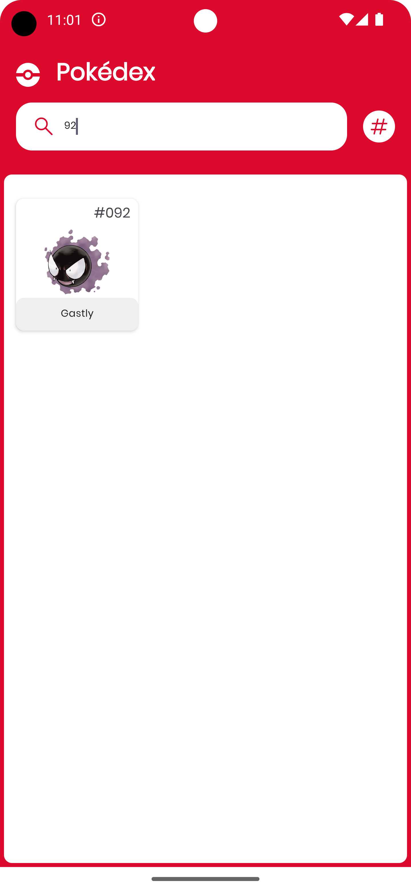
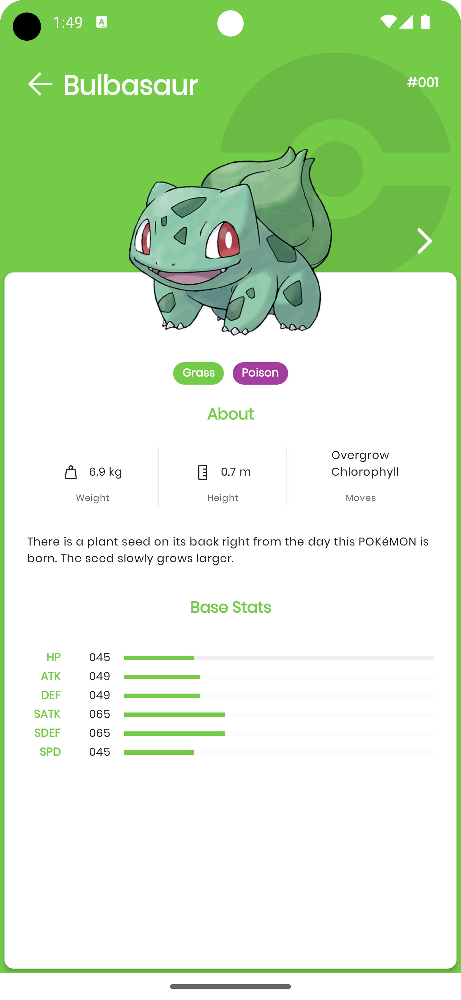

# Pokedex

This application is the final project of the Pazarama Android Bootcamp, developed as a individual
effort, and it involves listing and detailing Pokemon using data obtained
from [PokeApi](https://pokeapi.co/)

## Tech stack & Open-source libraries

- Minimum SDK level 23+
- 100% [Kotlin](https://kotlinlang.org/)
  based [Coroutines](https://github.com/Kotlin/kotlinx.coroutines) [Flow](https://developer.android.com/kotlin/flow)
  for asynchronous.

- [Android Architecture Components](https://developer.android.com/topic/architecture/intro?hl=en) -
  Collection
  of libraries that help you design robust, testable, and maintainable apps.
    - A single-activity architecture, using
      the [Navigation](https://developer.android.com/guide/navigation) to manage composable
      transactions.
    - Lifecycle - perform an
      action when lifecycle state change
    - [ViewModel](https://developer.android.com/topic/libraries/architecture/viewmodel?hl=en) -
      Stores
      UI-related data that isn't destroyed on UI changes.
    - [UseCases](https://developer.android.com/topic/architecture/domain-layer?hl=en) - Located
      domain
      layer
      that sits between the UI layer and the data layer.
    - [Repository](https://developer.android.com/topic/architecture/data-layer?hl=en) - Located in
      data
      layer that contains application data and business logic

- [Hilt](https://developer.android.com/training/dependency-injection/hilt-android?hl=en) -Dependency
  Injection Library
- [Navigation](https://developer.android.com/guide/navigation?hl=en) - Manage transaction among the
  fragments
- [DataBinding](https://developer.android.com/topic/libraries/data-binding?hl=en) - The Data Binding
  Library enables declarative binding of UI components to data sources in your app
- [Retrofit2 & OkHttp3](https://github.com/square/retrofit) - construct the REST APIs and paging
  network data.
- [Glide](https://github.com/bumptech/glide) - Image loading library
  ### Unit Testing
    - [ Flow Turbine](https://github.com/cashapp/turbine) - Turbine is a small testing library for
      kotlinx.coroutines Flow.
    - [Truth](https://truth.dev/) - A library for performing assertions in tests

## Demo

https://github.com/tolgaprm/Pokedex/assets/53945332/e4a3c707-b5f7-411d-84ef-c3326c957147

## Screenshots

| Pokedex Splash Screen                                   | PokedexList                                   | Pokedex List Search By Name                                              | Pokedex List Search By Number                                                | 
|---------------------------------------------------------|-----------------------------------------------|--------------------------------------------------------------------------|------------------------------------------------------------------------------|
|  |  |  |  |

| Pokedex List Search Error                                               | Pokedex List Error                                        | Pokedex List Sort By Name                                               |
|-------------------------------------------------------------------------|-----------------------------------------------------------|-------------------------------------------------------------------------|
|  |  |  |

| Detail Pokemon 1                                    | Detail Pokemon 2                                        | Detail Error                                  |
|-----------------------------------------------------|---------------------------------------------------------|-----------------------------------------------|
|  |  |  |
